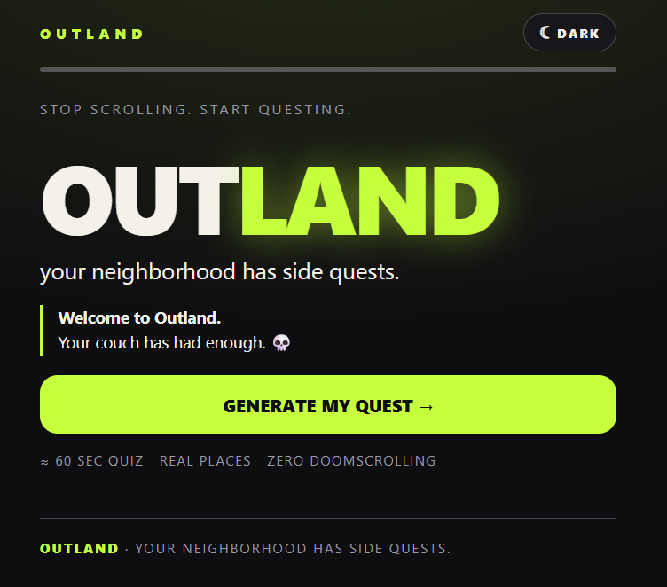
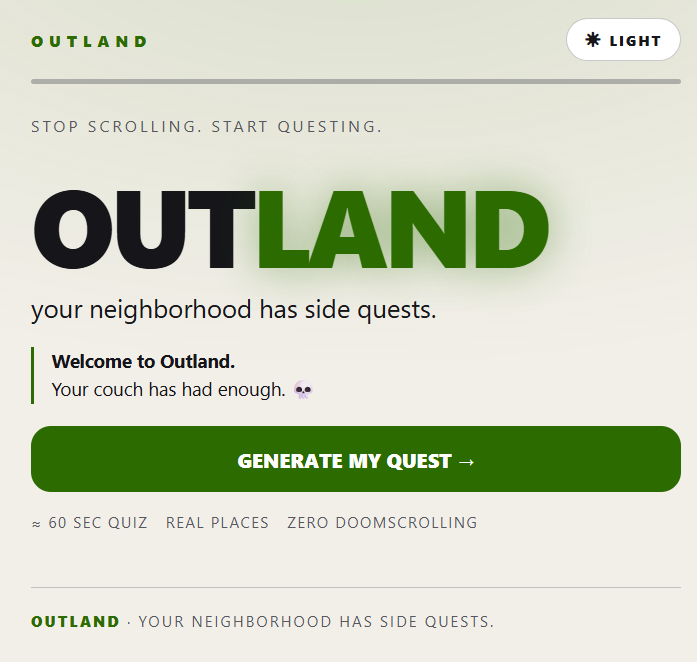
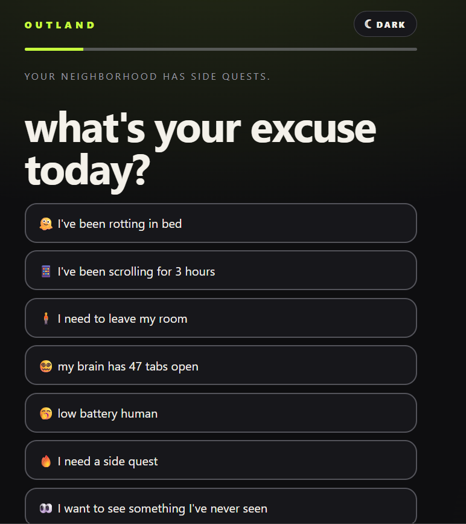
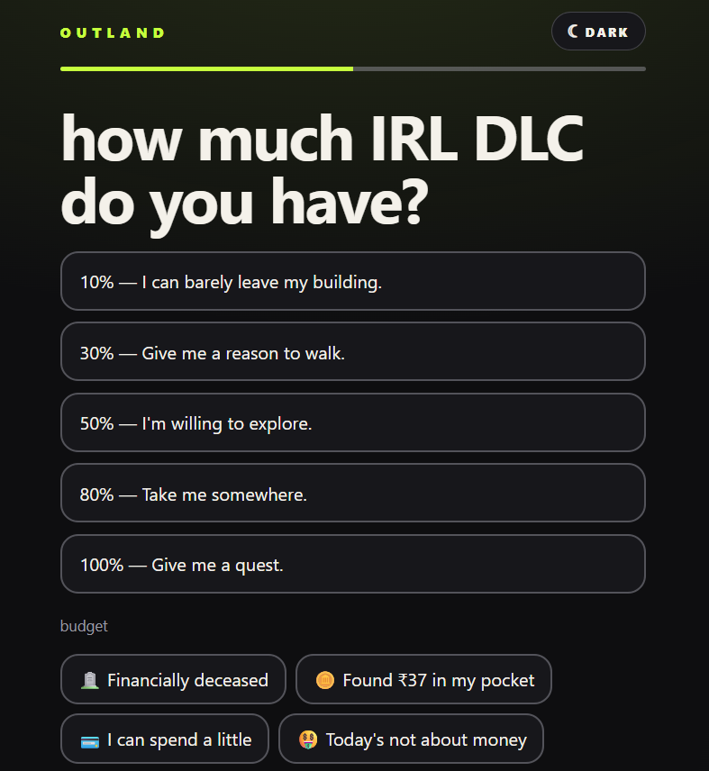
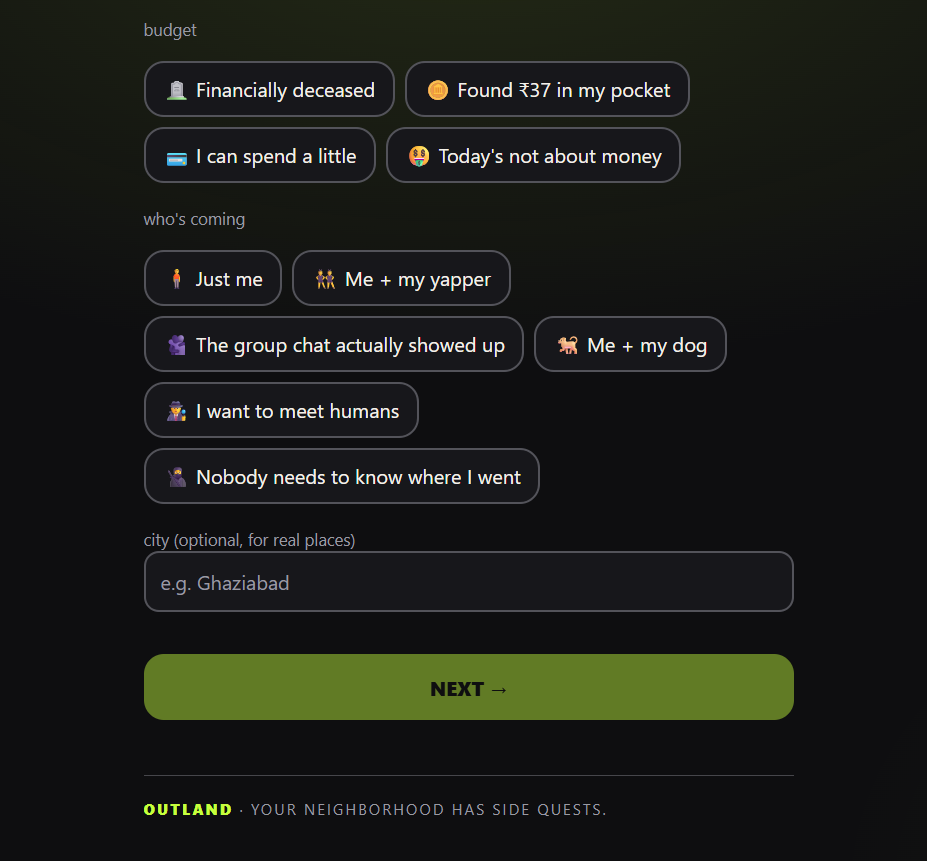
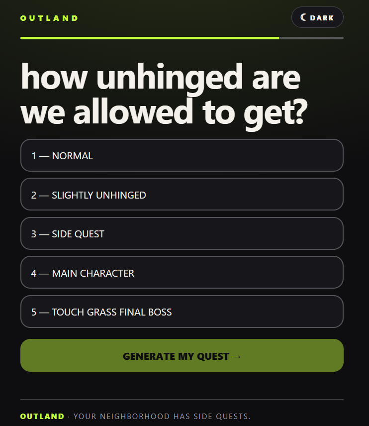
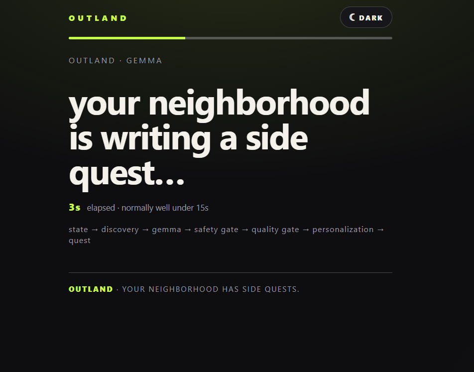
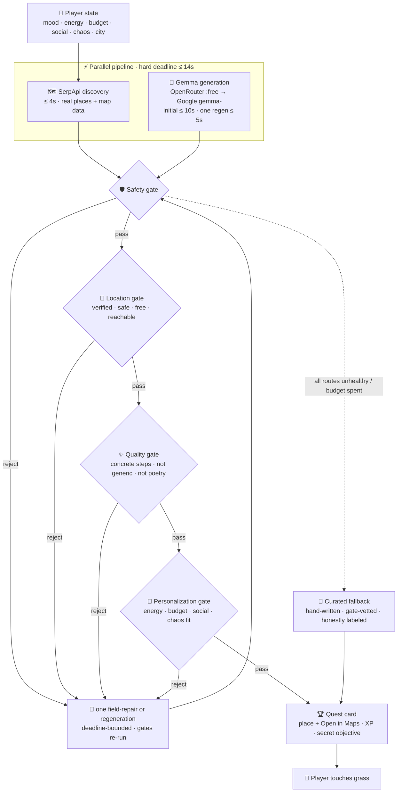

<p align="center">
<svg width="880" height="230" viewBox="0 0 880 230" fill="none" xmlns="http://www.w3.org/2000/svg" role="img" aria-label="OUTLAND — your neighborhood has side quests">
  <defs>
    <radialGradient id="glow" cx="50%" cy="50%" r="50%">
      <stop offset="0%" stop-color="#c6ff3d" stop-opacity="0.55"/>
      <stop offset="55%" stop-color="#c6ff3d" stop-opacity="0.12"/>
      <stop offset="100%" stop-color="#c6ff3d" stop-opacity="0"/>
      <animate attributeName="opacity" values="0.55;1;0.55" dur="3.2s" repeatCount="indefinite"/>
    </radialGradient>
    <linearGradient id="beam" x1="0" y1="0" x2="880" y2="0" gradientUnits="userSpaceOnUse">
      <stop offset="0" stop-color="#c6ff3d" stop-opacity="0"/>
      <stop offset=".5" stop-color="#c6ff3d" stop-opacity=".9"/>
      <stop offset="1" stop-color="#c6ff3d" stop-opacity="0"/>
      <animate attributeName="x1" values="-880;880" dur="4.5s" repeatCount="indefinite"/>
      <animate attributeName="x2" values="0;1760" dur="4.5s" repeatCount="indefinite"/>
    </linearGradient>
  </defs>
  <!-- card -->
  <rect x="1" y="1" width="878" height="228" rx="24" fill="#0e0e10" stroke="#2a2a30" stroke-width="2"/>
  <!-- pulsing glow behind the mark -->
  <circle cx="160" cy="105" r="88" fill="url(#glow)"/>
  <!-- the Outland mark: a tripping triangle / grass blade, gently bobbing -->
  <g transform="translate(160 105) scale(0.72) translate(-180 -150)">
    <path d="M180 96 L228 210 L180 188 L132 210 Z" fill="#c6ff3d">
      <animateTransform attributeName="transform" type="translate" values="0 0; 0 -8; 0 0" dur="2.6s" repeatCount="indefinite" calcMode="spline" keySplines="0.4 0 0.2 1; 0.4 0 0.2 1"/>
    </path>
    <!-- orbiting "quest marker" dot -->
    <circle cx="180" cy="150" r="64" stroke="#c6ff3d" stroke-opacity="0.25" stroke-dasharray="4 10" fill="none"/>
    <circle r="5" fill="#f4f1ea">
      <animateMotion dur="6s" repeatCount="indefinite" path="M 244,150 A 64,64 0 1 1 243.9,149"/>
    </circle>
  </g>
  <!-- wordmark -->
  <text x="270" y="94" font-family="ui-sans-serif, system-ui, sans-serif" font-size="56" font-weight="800" letter-spacing="9" fill="#f4f1ea">OUT<tspan fill="#c6ff3d">LAND</tspan></text>
  <!-- tagline: words fade in one by one, then loop -->
  <g font-family="ui-sans-serif, system-ui, sans-serif" font-size="18" fill="#9a9aa2" letter-spacing="4">
    <text x="272" y="126">STOP<tspan fill="#f4f1ea"> SCROLLING.</tspan></text>
    <text x="272" y="126" opacity="0">STOP SCROLLING.<tspan fill="#c6ff3d"> START QUESTING.</tspan>
      <animate attributeName="opacity" values="0;0;1;1;0" keyTimes="0;0.45;0.55;0.9;1" dur="5s" repeatCount="indefinite"/>
    </text>
  </g>
  <!-- animated stat chips -->
  <g font-family="ui-sans-serif, system-ui, sans-serif" font-size="13" font-weight="600">
    <g>
      <rect x="270" y="156" width="160" height="30" rx="15" fill="#17171b" stroke="#3a3a42"/>
      <text x="286" y="175" fill="#c6ff3d">⚡</text><text x="308" y="175" fill="#d5d2ca">quest in ≤ 14s</text>
      <animateTransform attributeName="transform" type="translate" values="0 0;0 -4;0 0" dur="3.4s" repeatCount="indefinite"/>
    </g>
    <g>
      <rect x="444" y="156" width="172" height="30" rx="15" fill="#17171b" stroke="#3a3a42"/>
      <text x="460" y="175" fill="#c6ff3d">📍</text><text x="482" y="175" fill="#d5d2ca">real, vetted places</text>
      <animateTransform attributeName="transform" type="translate" values="0 0;0 -4;0 0" dur="3.4s" begin="0.5s" repeatCount="indefinite"/>
    </g>
    <g>
      <rect x="630" y="156" width="148" height="30" rx="15" fill="#17171b" stroke="#3a3a42"/>
      <text x="646" y="175" fill="#c6ff3d">🛡</text><text x="668" y="175" fill="#d5d2ca">safety-gated</text>
      <animateTransform attributeName="transform" type="translate" values="0 0;0 -4;0 0" dur="3.4s" begin="1s" repeatCount="indefinite"/>
    </g>
  </g>
  <!-- sweeping light beam across the footer -->
  <rect x="0" y="198" width="220" height="2" fill="url(#beam)"/>
  <text x="440" y="214" text-anchor="middle" font-family="ui-monospace, monospace" font-size="11" fill="#57575f" letter-spacing="2">FREE-TIER GEMMA · SERPAPI · 96/96 TESTS · NODE ≥ 20 · RENDER-READY</text>
</svg>
</p>

<p align="center">
  <a href="https://img.shields.io/badge/tests-96%2F96-brightgreen?style=flat-square&logo=jest&logoColor=white"></a>
  <a href="server.js"></a>
  = 20" src="https://img.shields.io/badge/node-%3E%3D20-brightgreen?style=flat-square&logo=nodedotjs&logoColor=white"/>
  
  
  <a href="#-deploy-in-5-minutes"></a>
</p>

<h1 align="center">OUTLAND — your neighborhood has side quests</h1>

<p align="center">
  <b>Stop scrolling. Start questing. Your couch has had enough. 💀</b><br>
  An AI side-quest generator that turns “I should go outside” into a concrete,
  safe, <i>real-place-grounded</i> micro-adventure — built on free-tier Gemma.
</p>

---

## ✨ What it does

OUTLAND asks a handful of questions about your current state — **mood, energy, budget, social mode, chaos level, optional city** — and turns them into a playable IRL side quest:

- 🗺️ Discovers nearby points of interest via **SerpApi** (when a city is given)
- 📍 Grounds the quest in **one real, vetted place** and shows it on the card with an **Open in Maps** link
- 🤖 Generates a structured quest with **Google's Gemma** (free tiers only — OpenRouter → Google AI Studio)
- 🛡️ Vets everything through **safety → location → quality → personalization** gates
- 🧺 Serves a **curated, hand-written fallback** when inference is unavailable — and *labels it honestly*
- 📜 Traces the entire pipeline, every stage, every rejection

Quests are concrete micro-adventures: *observe something new, find the oldest doorway on your block, sit somewhere you've never sat.* Low cost, low barrier, zero pressure.

---

## 🎮 The 60-second flow

```
┌──────────────┐   ┌──────────────────┐   ┌────────────────┐   ┌─────────────────┐
│  ①  MOOD     │──▶│  ②  ENERGY       │──▶│  ③  CHAOS      │──▶│  ④  QUEST CARD  │
│  “I've been  │   │  budget · social │   │  1 → 5         │   │  📍 place · XP  │
│   scrolling  │   │  city (optional) │   │  TOUCH GRASS   │   │  steps · secret │
│   for 3 hrs” │   │  IRL DLC check   │   │  FINAL BOSS    │   │  Open in Maps ↗ │
└──────────────┘   └──────────────────┘   └────────────────┘   └─────────────────┘
                          │                       │                      ▲
                          └────── POST /api/quest ┴──────────────────────┘
                                 ≤ 14s worst case · honest trace on every card
```

---

## 📸 Screenshots

| | |
|---|---|
|  |  |
|  |  |
|  |  |

<p align="center">
  
</p>

---

## 🧠 Why AI is central

Gemma is not a decorative chatbot. It is the engine that transforms structured state + discovered real places into a **playable quest**: concrete steps, objectives, gamified rewards, and — when a city is provided — **at most one** real location that actually fits your energy, time, budget and social mode. Same prompt for everyone would produce the same walk around the block; Gemma makes it *yours*.

### How Gemma is actually used

| Stage | What happens |
|---|---|
| 1 · State | Structured player state extracted: mood, energy, minutes, budget (₹0–₹500), social, chaos, city |
| 2 · Discovery | SerpApi (optional) finds real places + map data in parallel with generation |
| 3 · Generation | Strict JSON schema + hard constraints sent to Gemma (IRL-only, no paid activities unless budget allows, no sensitive locations…) |
| 4 · Parse | Response parsed & schema-validated |
| 5 · Gates | Safety → location → quality → personalization gates, each rejectable with actionable feedback |
| 6 · Regen | **One** short, deadline-bounded regeneration (or a single-field *repair*) after a gate rejection |
| 7 · Serve | Quest served with full traceability — or a curated fallback, clearly labeled |

**Provider/model (as configured):** `google-generative-ai` / `gemma-4-26b-a4b-it`

- **Route 1 (primary):** OpenRouter free endpoints — `google/gemma-4-26b-a4b-it:free`, `google/gemma-4-31b-it:free` (code enforces `:free` suffixes; paid models are never routed)
- **Route 2 (fallback):** Google AI Studio — `gemma-4-26b-a4b-it`, `gemma-4-31b-it` (code enforces the `gemma-` prefix)

Both routes sit behind **timeouts, cooldowns, and per-process circuit breakers** with escalating backoff. A single generation budget per request means a dead provider can never make a player wait.

---

## 🗺️ SerpApi's role

When a city is provided, SerpApi discovers real-world context (parks, viewpoints, landmarks, quiet streets). Discovery is **not a display dump**: Gemma selects *at most one* discovered place that fits the player, returned as a structured object:

```json
"location": {
  "name": "Meghdootam Park",
  "reason": "quiet public green space suitable for a low-energy observation quest",
  "source": "serpapi"
}
```

Before the player sees it, the **location gate** verifies that it:

- ✅ is one of the *actually discovered* places — never invented
- ✅ is safe and public
- ✅ is free when the budget is ₹0
- ✅ is reachable inside the available time and energy
- ✅ fits the social mode

A rejected selection is regenerated with feedback. A surviving quest carries a verified place — or `location: null`. The card shows the destination prominently (`📍 MEGHDOOTAM PARK · Your side quest happens here.`) plus an **Open in Maps ↗** link built *only* from SerpApi's own coordinates / place id / address — never from invented data.

---

## 🏗️ Complete architecture



<sub>Every arrow above is a stage in the <code>trace</code> array returned on each response — open the “pipeline trace” details on any quest card to see it live.</sub>

---

## ⏱️ Latency contract

Every value is a **hard ceiling, never a target**, and is surfaced in the trace instead of hidden:

| Budget | Value | Notes |
|---|---|---|
| Discovery | **≤ 4 s** | Runs in parallel with generation |
| Initial generation | **≤ 10 s** | OpenRouter attempt ≤ 7 s, Google attempt ≤ 9 s |
| One regeneration | **≤ 5 s** | A gate rejection must never stack a second long wait |
| Bounded output | **700 tokens** | Without `maxOutputTokens` Gemma rambles for 40–75 s |
| **Worst-case request** | **≈ 14 s** | Then a curated fallback is served — always |

```
 request timeline (worst case)
 0s                4s              10s            14s
 ├─ discovery ─────┤                │              │
 ├────── generation ────────────────┤              │
 │                   ├─ regen (only if rejected) ──┤
 │                                                └─▶ curated fallback · honest trace
 healthy path:  Gemma answers in ~3–6s → gates pass → quest served as GEMMA
```

A field repair (one weak field on an otherwise strong quest) asks for only **380 tokens** and finishes proportionally sooner inside the regeneration budget.

---

## 🛡️ Safety system

Every quest — AI-generated **or** curated — must pass the safety gate. Blocked:

- ☠️ Dangerous, illegal, or harmful activities
- 🚫 Sensitive/private locations or invasive behavior
- 📵 Anything encouraging unsafe practices
- 🛋️ Anything that violates the “IRL, touch grass” intent

The safety gate is **never skipped or weakened** on the repair/regeneration path — it is simply re-run on the merged result. Curated fallback quests are hand-written and vetted by the same rules.

---

## 🏷️ Honest labeling: Gemma vs curated

The trace **explicitly distinguishes** sources — curated content is *never* labeled as Gemma:

| Trace label | Meaning |
|---|---|
| `GEMMA` / `gemma_generate` / `gemma_regenerate` | real model output |
| `SERPAPI` | discovery stage |
| `CURATED FALLBACK` / `curated_fallback` | hand-written quest served due to inference unavailability |
| `REGENERATION` | feedback-driven retry |
| `SAFETY REJECTION` | blocked by safety gate |
| `QUALITY REJECTION` | blocked by quality gate |
| `TIMEOUT` | generation exceeded budget |
| `RATE LIMIT` | provider returned 429 |
| `circuit_check` | all routes unhealthy → fast fallback, no provider wait |

**If Gemma succeeds, the card shows the real provider and model. If fallback happens, it is labeled curated.** That's the whole honesty contract.

---

## 🎰 Gamification

| Rarity | Color | Example |
|---|---|---|
| COMMON | <span style="color:#9a9aa2">⚪ gray</span> | `THE 400-METER EXPEDITION` |
| UNCOMMON | <span style="color:#7bd44a">🟢 green</span> | `THREE SOUNDS` |
| RARE | <span style="color:#5ac8fa">🔵 blue</span> | `THE NEIGHBOURHOOD LORE RUN` |
| EPIC | <span style="color:#c08cff">🟣 violet</span> | `FARTHER THAN USUAL` |
| LEGENDARY | <span style="color:#ffb020">🟠 amber</span> | reserved for the unhinged |

Each quest carries:

- **XP** scaled by difficulty & duration
- **Rarity** + **archetype** (EXPLORER, MEMORY QUEST, OBSERVER, BOSS QUEST, NATURE, PHOTO HUNT, SOUND HUNT…)
- **Bonus objective** — optional extra challenge
- **Secret objective** — hidden until tapped (`??? SECRET OBJECTIVE`)
- **Energy-aware scaling** — a 10 % battery human never gets a 75-minute boss quest

---

## 🧺 Curated fallback pool

**10** hand-written, energy-aware quests (energy floors 0 → 81). They pass the same safety and personalization gates as Gemma output and are designed to feel like *real Outland side quests* — not “go for a walk” filler. When SerpApi discoveries are available, the best free public one that passes every gate is attached to the card (labelled `via: "nearby"` — never claimed as a Gemma selection); with no discoveries, the quest stays location-independent.

<details>
<summary><b>Expand the pool</b> (energy floor · rarity · archetype)</summary>

| Min energy | Title | Rarity | Archetype | Duration |
|---:|---|---|---|---:|
| 0 | THE 400-METER EXPEDITION | COMMON | EXPLORER | 12 min |
| 0 | QUIET PATCH | COMMON | NATURE | 8 min |
| 0 | ONE LEAF QUEST | COMMON | PHOTO HUNT | 8 min |
| 5 | THREE SOUNDS | UNCOMMON | SOUND HUNT | 10 min |
| 10 | STREET LETTERS | COMMON | PHOTO HUNT | 12 min |
| 15 | THE LOOP OF UNPROVOKED FRESH AIR | UNCOMMON | MEMORY QUEST | 25 min |
| 20 | COLOR HUNT | UNCOMMON | COLOR QUEST | 20 min |
| 30 | THE NEIGHBOURHOOD LORE RUN | RARE | OBSERVER | 45 min |
| 40 | MICRO EXPEDITION | UNCOMMON | EXPLORER | 30 min |
| 81 | FARTHER THAN USUAL | EPIC | BOSS QUEST | 75 min |

</details>

---

## 🎬 UI & motion

The whole app is a single accessible `index.html` — no framework, no build step:

- 🌗 **Dark / light themes**, each designed as its own palette (paper + ink + forest accent), with an inline pre-paint script so there is **no flash of the wrong theme**
- 🎞️ **GSAP + ScrollTrigger** timeline on the quest card (title → hook → location → stats → steps stagger) — served **straight from `node_modules`** at `/vendor/gsap.min.js` and `/vendor/ScrollTrigger.min.js`: no CDN, no third-party runtime, no API key
- 🪂 If GSAP ever fails to load, **CSS keyframes** take over automatically
- ♿ **`prefers-reduced-motion`** disables all animation
- 🧭 Proper focus management (`tabindex="-1"` headings, visible focus rings), `aria-pressed` chips, `aria-live` progress region
- 📍 Map links are only rendered when the server returned a grounded `https://www.google.com/maps/…` URL — anything else shows the place name with no fake affordance

---

## ✅ Testing

<p>
   &nbsp;
  <code>npm test</code> · node:test · zero extra test deps
</p>

Coverage includes: safety gate, quality gate, personalization gate, location grounding (verified SerpApi selection, budget/energy/social/time compatibility, map-link rules), provider routing (timeouts, 429s, circuit breakers, failover, escalating cooldowns), the latency contract, regeneration deadlines, field repair, deduplication, curated selection, and edge cases.

<details>
<summary>Reproducible demo & QA scripts</summary>

```bash
npm run demo     # 12-request latency/routing report against a running server
npm run live     # live quest attempts across both Gemma routes
npm run ui-qa    # headless-Chrome UI QA pass (needs Chrome installed)
```

</details>

---

## 🚀 Local development

```bash
git clone https://github.com/LovelySharma-dev/Outland---TouchGrass.git
cd Outland---TouchGrass
npm install
cp .env.example .env        # then fill in your free-tier keys
npm start                   # → http://localhost:3000
```

| Command | What it does |
|---|---|
| `npm start` | run the server |
| `npm test` | full test suite (96 tests) |
| `npm run build` | syntax-check `server.js` (used as the Render build step) |
| `npm run demo` | 12-request reproducible demo report |
| `npm run live` | live quest attempts |
| `npm run ui-qa` | headless Chrome UI QA |

---

## 🔐 Environment variables

Required keys (free-tier only — the code never routes a paid model):

```env
# Route 1 · primary — OpenRouter free Gemma
OPENROUTER_API_KEY=

# Route 2 · fallback — Google AI Studio Gemma
GEMMA_API_KEY=

# Real-world place discovery (optional but recommended)
SERPAPI_KEY=
```

Optional:

```env
# Model overrides — free-only filters are enforced in server.js:
# OpenRouter ids must end in ":free", Google ids must start with "gemma-"
# OPENROUTER_MODEL=google/gemma-4-26b-a4b-it:free,google/gemma-4-31b-it:free
# GEMMA_MODEL=gemma-4-26b-a4b-it,gemma-4-31b-it

# Reported by /health, not required for core functionality
# SENTRY_DSN=
# MONGODB_URI=
```

---

## ☁️ Deploy in 5 minutes

Deployment is fully specified by [`render.yaml`](render.yaml) (Blueprint):

1. **Push to GitHub** — this repo
2. On [render.com](https://render.com) → **New → Blueprint** → pick the repo; Render reads `render.yaml` automatically
3. Fill the env vars the Blueprint prompts for (`sync: false` keys):
   `OPENROUTER_API_KEY` · `GEMMA_API_KEY` · `SERPAPI_KEY` (optional: `SENTRY_DSN`, `MONGODB_URI`)
4. Deploy — build runs `npm install && npm run build`, start runs `npm start`
5. Render health-checks **`/health`**, which reports route circuits, timing budgets and which keys are live

```yaml
# render.yaml (source of truth)
buildCommand: npm install && npm run build
startCommand: npm start
healthCheckPath: /health
```

The server binds `process.env.PORT` (Render sets it automatically) and defaults to `3000` locally. Free-tier instances spin down when idle — the first request after idle takes ~30s, then the ≤ 14s contract applies.

### Verifying a deploy

```bash
curl https://<your-app>.onrender.com/health
```

```jsonc
{
  "ok": true,
  "routes": [
    { "provider": "openrouter", "models": ["google/gemma-4-26b-a4b-it:free", "..."], "circuit": "closed" },
    { "provider": "google-generative-ai", "models": ["gemma-4-26b-a4b-it", "..."], "circuit": "closed" }
  ],
  "timing": { "gen_budget_ms": 10000, "regen_budget_ms": 5000, "max_output_tokens": 700 },
  "openrouter": true, "gemma_key": true, "serpapi": true,
  "mongo": false, "sentry": false
}
```

Then: `curl -X POST …/api/quest -H 'Content-Type: application/json' -d '{"state":"scrolling","energy":50,"budget":0,"social":"solo","chaos":2,"city":"Ghaziabad"}'` and check that `source` is honestly `gemma-…` or `curated-fallback`.

---

## 📡 API at a glance

<details>
<summary><code>POST /api/quest</code> · request & response</summary>

**Request**

```jsonc
{
  "state":   "scrolling",          // mood key from the UI
  "energy":  50,                   // 10 | 30 | 50 | 80 | 100
  "budget":  0,                    // 0 | 50 | 200 | 500 (₹)
  "social":  "solo",               // solo | yapper | group | dog | meet-humans | secret
  "chaos":   2,                    // 1..5
  "city":    "Ghaziabad",          // optional — enables SerpApi grounding
  "excuse":  "my brain has 47 tabs open"  // optional, ≤200 chars
}
```

**Response (success)**

```jsonc
{
  "quest": {
    "title": "…", "hook": "…", "objective": "…",
    "steps": ["…", "…"],
    "bonus_objective": "…", "secret_objective": "…",
    "xp": 55, "rarity": "UNCOMMON", "category": "OBSERVER",
    "difficulty": "medium", "duration_minutes": 25, "budget": 0,
    "done_when": "…", "safety": ["…"],
    "location": { "name": "…", "reason": "…", "map_url": "https://www.google.com/maps/…", "via": "serpapi" }
  },
  "source": "gemma",                     // or "curated-fallback"
  "provider": "google-generative-ai",    // present only on real Gemma output
  "trace": [ /* every pipeline stage */ ],
  "latency_ms": 4821
}
```

**Errors:** `400 invalid input` · `503` nothing safe to serve right now.

</details>

<details>
<summary><code>GET /health</code></summary>

Returns route circuit states (open/closed + retry timers), the full `TIMING` budget, and which integration keys are configured. Used by Render's health check and by the demo script.

</details>

---

## ⚠️ Known limitation: free-tier Gemma reliability

Free inference endpoints time out and return 429s. Real Gemma generation therefore succeeds *intermittently* in live conditions. OUTLAND keeps the experience safe and predictable by:

- ✅ bounding every request by strict timeouts and a generation budget
- ✅ circuit-breaking dead routes with **escalating cooldowns** (30s → 60s → 120s cap) that outlive the failing attempt
- ✅ skipping all-wait via a fast `circuit_check` → curated fallback in ~30 ms
- ✅ serving a gate-vetted curated fallback when Gemma can't deliver in budget
- ✅ **never** fabricating a Gemma success — the trace always tells the truth

---

## 📄 License

[MIT](LICENSE) — go touch grass.

<p align="center">
  <sub>Built with free-tier Gemma · SerpApi · Express · GSAP · zero paid inference</sub><br>
  <sub><b>OUTLAND</b> · your neighborhood has side quests</sub>
</p>
